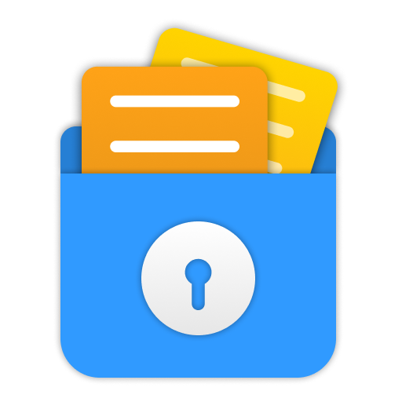

<h3 align="center">Cloak - File encryption made easy</h3>

A simple GUI for gocryptfs.

  
  
  
  

Cloak is a simple GUI for gocryptfs built with Golang and web tech. It works on macOS and Linux.

Features:

- A simple UI for managing your gocryptfs vaults, just like Cryptomator.
- Password changing / password resetting (with master key).
- Warn you about password strength.
- Fast to launch or quit.
- Internationalization. Current supported languages:
  - English
  - Simplified Chinese

UI / interaction mimicked from Cryptomator.

# Usage

- Download prebuilt binaries from [releases page](https://github.com/Cloaklet/Cloak/releases/latest/).
- For Linux users, set executable permission for the `AppImage` file (alternatively you can use `chmod +x Cloak*.AppImage`), then just run it.
- For macOS users, after decompressing the ZIP archive, you might need to run `xattr -d -r com.apple.quarantine Cloak.app` in Terminal, otherwise GateKeeper would refuse to run the app.
- You can open the UI or quit the app via `Open` menu item of the tray icon (or menubar icon).

# Where is my data stored?

- Vault list is stored at:
  - `$XDG_DATA_HOME/Cloak` on Linux. If `$XDG_DATA_HOME` is not set, [it falls back to `$HOME/.local/share`](https://github.com/adrg/xdg#default-locations).
  - `~/Library/Application Support/Cloak` on macOS, see Apple's [Library Directory Details](https://developer.apple.com/library/archive/documentation/FileManagement/Conceptual/FileSystemProgrammingGuide/MacOSXDirectories/MacOSXDirectories.html#//apple_ref/doc/uid/TP40010672-CH10-SW1)
- Configuration file is stored at:
  - `$XDG_CONFIG_HOME/Cloak` on Linux. If `$XDG_CONFIG_HOME` is not set, [it falls back to `$HOME/.config`](https://github.com/adrg/xdg#default-locations).
  - `~/Library/Application Support/Cloak` on macOS.
- Log files are stored at:
  - `$XDG_DATA_HOME/Cloak/logs` on Linux.
  - `~/Library/Logs/Cloak` on macOS.

Before `0.8.0`, Cloak store all its data and log files in `~/.cloaklet.cloak` directory on Linux.
By running a new version of Cloak, they get moved to the new directories.

Cloak automatically clears log file content each time it starts up.
Sensitive information like vault passwords or master keys are never logged.

# Why

I wrote a similar GUI called [Cloaklet](https://github.com/Cloaklet/Cloaklet) using QML + Golang.
However, I don't enjoy developing in QML at all, and quickly ran into some issues which I can't resolve.
After that I went back to use Cryptomator, but its UI feels slow and somehow inconsistent.
This time I got an idea from one of my early projects to use web browser as UI renderer, thus this new project.

# To build

## For macOS

Notice: you have to use a running instance of macOS, either a VM or a real Apple computer.

- Install Xcode related stuff with `xcode-select --install`.
- Install frontend dependencies: `cd frontend && npm install`.
- Run `go run build.go build` in project root, and it should create the `Cloak.app` bundle.
- Double click to start the app.

## For Linux

- Install required libraries: `sudo apt install libappindicator3-dev gcc libgtk-3-dev libxapp-dev`.
- Install frontend dependencies: `cd frontend && npm install`.
- Run `go run build.go build` and it should produce an AppImage binary.

The AppImage binary includes all required libraries and tools, so you can run it right away.

# To develop

## Frontend

The frontend (UI) project resides in `frontend` directory. It's a standard Vue project managed by vue-cli.

- Install dependencies: `npm install` inside `frontend` directory.
- Simply run `npm run serve` inside `frontend` directory.
- You can also run the `serve` task from vue-cli UI, run `vue ui` to get started.

## Backend

You should build the frontend project first so the backend can find assets for the UI.

- Inside the `frontend` directory, run `npm run build`.
- Run `go generate ./...` to generate necessary source codes.
- To run the app, simply invoke `go run .` in the project root.

# Notice

- `gocryptfs` requires `FUSE` to function. For macOS please install `OSXFUSE` (now [macFUSE](https://osxfuse.github.io/)).
- Windows is not supported, because `gocryptfs` does not work on Windows.
- Avoid committing `statik` module because it contains large blob of files produced by the frontend project.
- If you are building the app yourself, missing `libxapp-dev` would not result in error; But when running the built AppImage on Linux Mint, menu item will lose highlighting.
- You should install `xdg-open` on Linux, otherwise drive revealing will not work.

# Credits

- [RemixIcon](https://remixicon.com/)

# License

GPL v3, see LICENSE file.